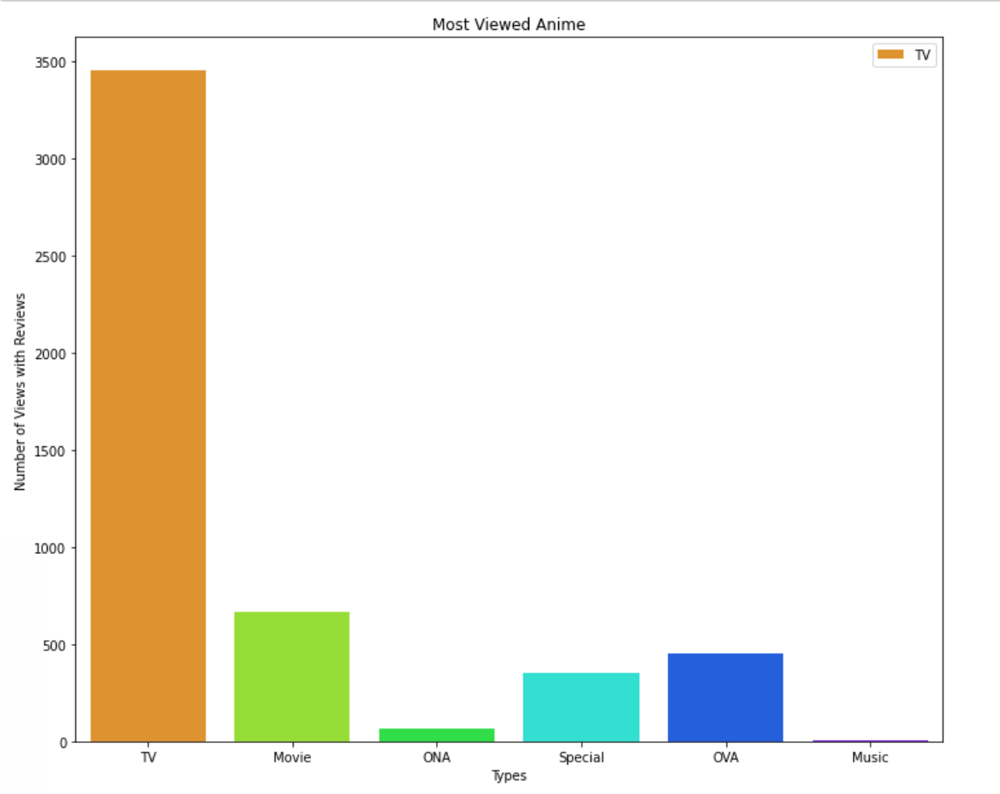

# Recommendation System for Anime

I created a recommendation system that allows people to find anime to watch. 
As the world still resides in lockdown and everyone has just about watched every interesting show on netflix, it may be useful to try something new and different.
A last sentence links to any productionized web dashboard here.

You can also link to 
* [anila.m.qureshi@gmail.com()
* [https://www.linkedin.com/in/aneela-qureshi-262aa670/]()
* [https://twitter.com/aneeliabedelia]()

### Executive Summary

Covid19 has affected each and everyone of us globally. Since many countries have shut their borders and have ordered everyone to stay home, this has limited all of us. The confinement has created a surge in consumers streaming more entertainnment. It is not just Netflix that is seeing an increase in user traffic. Most European countries have been in lockdown for over 60 days, this includes bank holidays and half term holidays and easter for those who have children. By now most of us have already watched most of recommended shows on all streaming sites and need to find something new.

Anime, is a hand drawn and computer animation originating from Japan which is widely drawn a cult following around the world. The animation industry consists of more than 430 companies. Some of the most popular anime that has come to Western television is Pokemon and Yugi-Oh ."Spirited Away" a film created by Hayao Miyazaki and animated by Studio Ghibli is the highest grossing film within the anime genre. The reason it became so popular in the west is because a good friend of Miyazaki convinced him to sell distribution rights to Walt Disney. Like Spirited Away, there are thousands of really good anime films and shows produced by the same animation house. Due to the pandemic a nice way to bring such works of art into Disney plus or any streaming site in the West I have created a recommendation system that can help anyone or any company to view/add the highest rated anime. The Japan External Trade Organization has valued overseas sales to  18𝑏𝑖𝑙𝑙𝑖𝑜𝑛( 5.2 billion for the US alone) in 2004. This has likely grown. With covid19 looming over Japan which has caused one of the first long term recessions for the country. A way at which potential growth could take place is focusing on streaming and producing more of the top recommended.

Below I am creating a recommendation system for anime. This will help with the above problem and can help to create more in demand anime that is similar. It can also help anyone who is not familiar with the niche genre to quickly find top rated items. (Helping to grow the market).

I have downloaded anime and user ratings from https://www.kaggle.com/CooperUnion/anime-recommendations-database . I will conduct exploratory data analysis to familiarise the reader and myself with the data presented. From there I have created a baseline model using Singular Value Decomposition(SVD). PLEASE NOTE THE BASELINE MODEL IS TOWARDS THE BOTTOM. I will then do memory based models which will look at user based v item based. I will use KNNBase, KNNBaseline and KNNWithMeans. Then I will take the top performing model and evaluate its root mean squared error (rmse) and its mean absolute error (mae). 

### More Information

Based off of the modelling done, it would be best to conduct more statistical analysis on top rated and viewed anime that comes from the same animation studios, writers, directors and media houses. From here we can tweek the recommendation system to include their newest releases. 

Another suggestion is to look at a time component analysis. TV shows are the most viewed type of anime, during which time of year. From here the recommendation system can help to fill in the gaps within the fiscal year for anime studios. They can either spread out the dates or work on a new pipeline for creating more specials. 

### Glimpse of some Data Viz

> Image taken from `copy_of_mvp.ipynp` [documentation](https://github.com/anilaq/capstone/blob/master/Copy_of_mvp.ipynb)

### Sources: 
* [https://en.wikipedia.org/wiki/Anime#Industry()
* [https://en.wikipedia.org/wiki/Spirited_Away()
* [https://sifted.eu/articles/streaming-startups-coronavirus/()

